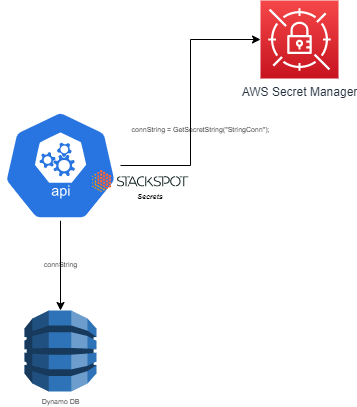

O **secrets-app-cs-plugin** adiciona em uma stack a capacidade de provisionar o uso de segredos armazenados na AWS Secrets Manager, reduzindo o risco da exposição de dados sensíveis no código, como logins e senhas de vários tipos (banco de dados, recursos de rede, etc.), chaves de API, chaves de criptografia e similares.

